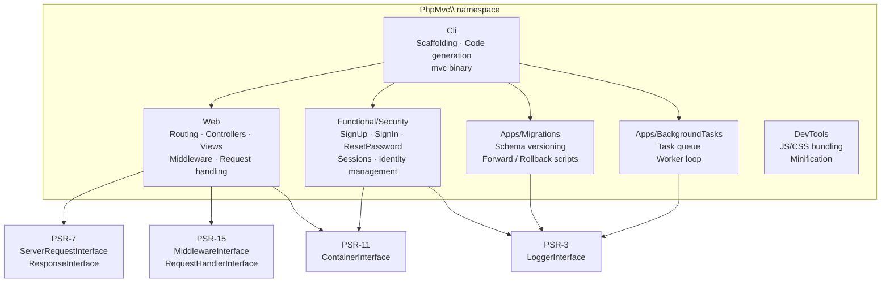
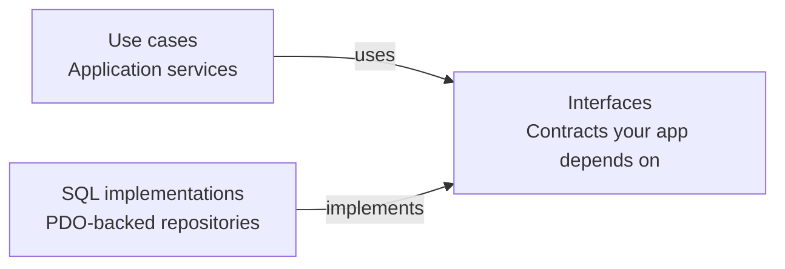

# Architecture

PHP MVC is a modular MVC framework. The core web layer handles routing, controllers, views, and the middleware pipeline. Optional feature modules (Security, Migrations, BackgroundTasks) are self-contained and can be enabled independently via the CLI.

## Module map



## Module internals

Each feature module exposes interfaces that your application depends on, and ships concrete SQL-backed implementations you can swap out:



Register the SQL implementations in your container with a single call (e.g. `Security\Dependencies::configure($container)`), or bind your own implementations if you use a different storage backend.

## PSR compliance

| Standard | Role |
|----------|------|
| PSR-4 | Autoloading — all classes under `PhpMvc\` |
| PSR-7 | HTTP messages — `ServerRequestInterface`, `ResponseInterface` |
| PSR-11 | Dependency injection container — `ContainerInterface` |
| PSR-15 | HTTP middleware — `MiddlewareInterface`, `RequestHandlerInterface` |
| PSR-3 | Logging — `LoggerInterface` |

The framework depends only on the PSR interface packages (`psr/*`). You choose the concrete implementations.

## Namespace structure

```
PhpMvc\
├── Web\            — HTTP layer (routing, controllers, views, middleware)
├── Functional\
│   └── Security\   — auth use cases, identity, sessions
├── Apps\
│   ├── Migrations\         — database migrations
│   └── BackgroundTasks\    — queued task processing
├── Cli\            — scaffolding commands
└── DevTools\       — JS/CSS asset builders
```

## Design principles

- **Security by default** — inputs are normalized and HTML-escaped; CSRF protection is opt-in but trivial to enable.
- **Predictable behavior** — strong typing for action parameters and DTOs; no magic globals.
- **Simple integration** — everything wires through `MvcWebApp` and the PSR-11 container.
- **No hidden state** — middlewares and services are registered explicitly in the composition root before `run()`.
