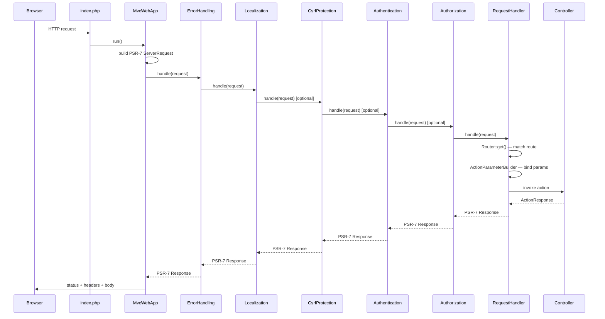

# Request Lifecycle

This page traces the path of an HTTP request through the framework from the moment PHP is invoked until the response is sent.

## Sequence diagram



## Stage-by-stage explanation

### 1. Entrypoint (`index.php`)

Your composition root registers all services on the PSR-11 container, then constructs `MvcWebApp` (your subclass) and calls `run()`. Everything the middlewares and controllers need must already be in the container at this point.

### 2. `MvcWebApp::run()`

Builds an HTTP request from PHP globals and delegates to the middleware pipeline.

### 3. `ErrorHandling` middleware

Wraps the entire remaining chain. Any uncaught exception is converted into an HTTP error response. The browser always receives a well-formed response even on fatal errors.

### 4. `Localization` middleware

Detects the request locale from `Accept-Language` or a cookie. The view engine uses this locale to resolve i18n keys automatically.

### 5. `CsrfProtection` middleware _(optional)_

Enabled via `$app->useCsrfProtection()`. Generates and validates CSRF tokens. Returns `403 Forbidden` if a state-changing request (`POST`, `PUT`, `PATCH`, `DELETE`) arrives without a valid token.

### 6. `Authentication` middleware _(optional)_

Enabled via `$app->useAuthentication()`. Reads the auth cookie and loads the user identity. Does not block unauthenticated requests — that is `Authorization`'s job.

### 7. `Authorization` middleware _(optional)_

Enabled via `$app->useAuthorization()`. Checks `authRequired` and `roles` on the matched route. Redirects unauthenticated users to the sign-in page. Returns `403 Forbidden` for authenticated users lacking the required role.

### 8. Request handler

Matches the route, binds typed action parameters from path segments, query string, and request body, then invokes the controller action and converts its response to HTTP.

### 9. Response propagation

Each middleware may add headers on the way back out (e.g. auth session refresh). The final response is written to PHP's output.

## Adding custom middleware

Custom middlewares run inside the fixed outer chain (after `Localization`, before `RequestHandler`):

```php
$app->addMiddleware(MyRateLimitMiddleware::class);
```

See [Middleware](../web/middleware.md) for the full `MiddlewareInterface` contract.
