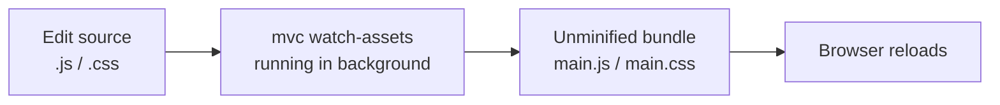

# Asset Bundling

The CLI can merge and optionally minify your app's JavaScript and CSS source files into single bundles for the browser. Use `mvc watch-assets` during development and `mvc create-bundle` for production.

## Configuration (`mvc.config.json`)

### Output locations and filenames

| Key | Default | Description |
|-----|---------|-------------|
| `jsAssetsPath` | `./assets/scripts` | Directory where JS bundles are written. |
| `cssAssetsPath` | `./assets/styles` | Directory where CSS bundles are written. |
| `mainJsBundler` | `main.min.js` | Minified JS bundle (production). Reference in layouts. |
| `mainCssBundler` | `main.min.css` | Minified CSS bundle (production). |
| `devMainJsBundler` | `main.js` | Unminified JS bundle (development). |
| `devMainCssBundler` | `main.css` | Unminified CSS bundle (development). |
| `useDevAssets` | `false` | When `true`, layouts load dev bundles instead of minified files. |

### Source lists: `assetRoutes`

`assetRoutes` is an ordered array of source groups. The CLI merges all `js` and `css` paths in order into a single JS bundle and a single CSS bundle. Duplicate paths are included only once (first occurrence wins).

```json
{
  "assetRoutes": [
    {
      "label": "base",
      "js":  ["assets/scripts/core.js"],
      "css": ["assets/styles/root.css", "assets/styles/layout.css"]
    },
    {
      "label": "dashboard",
      "js":  ["assets/scripts/dashboard.js"],
      "css": ["assets/styles/dashboard.css"]
    }
  ]
}
```

You may omit `js` or `css` on any group if that side is empty.

## Commands

### Watch (development)

```bash
vendor/bin/mvc watch-assets --app-path=./src/MyApp
```

Polls source files and rebuilds **unminified** bundles when they change. Does not write minified files. Loops until interrupted.

### Production bundle

```bash
vendor/bin/mvc create-bundle --app-path=./src/MyApp
```

Merges and **minifies** all sources into `mainJsBundler` and `mainCssBundler`.

## Development workflow



1. Set `useDevAssets: true` in `mvc.config.json`.
2. In one terminal, run `mvc watch-assets --app-path=<your-app>`.
3. In another, start your PHP server.
4. Edit source files; the watcher rebuilds the dev bundles automatically.
5. Before deploying: set `useDevAssets: false`, run `mvc create-bundle`, deploy.

## Serving bundles in HTML

Your layout template references the bundle filenames via the `UiAssetsSettings` context values:

```html
<link rel="stylesheet" href="/{{mainCssBundler}}">
<!-- ... -->
<script src="/{{mainJsBundler}}"></script>
```

When `useDevAssets: true`, the template variables resolve to `devMainCssBundler`/`devMainJsBundler`. When `false`, they resolve to the minified names.

## Scaffolded apps

Running `mvc create-app` generates:

- `assets/scripts/main.js` — empty JS entry point.
- `assets/styles/main.css` — empty CSS entry point.
- A default `assetRoutes` entry pointing at these files.

So `mvc watch-assets` and `mvc create-bundle` work out of the box after scaffolding.

## Related documentation

- [Configuration Reference](../getting-started/configuration.md) — full `mvc.config.json` key reference.
- [CLI Reference](../cli/reference.md) — `watch-assets` and `create-bundle` flags.
