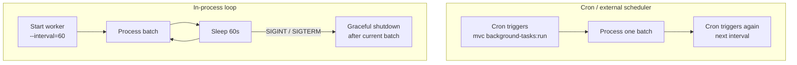

# Background Tasks

The background tasks module provides a SQL-backed task queue for work that should run outside the web request — sending emails, generating reports, processing uploads, and so on.

## Enable

Migrations must be enabled first (the default SQL storage requires a table):

```bash
vendor/bin/mvc migrations:enable --path=<app-dir>
```

Then scaffold and enable the module:

```bash
# Step 1: scaffold the BackgroundTasks folder and stubs
vendor/bin/mvc initialize-background-tasks [--path=<app-dir>]

# Step 2: enable and generate the migration for background_tasks table
vendor/bin/mvc background-tasks:enable [--path=<app-dir>] [--skip-migrations]
```

| Option | Description |
|--------|-------------|
| `--path` | App root (default: current directory). |
| `--skip-migrations` | Only set `backgroundTasksEnabled: true`. Use when providing a custom `TaskRepository`. |

Apply the generated migration:

```bash
vendor/bin/mvc migrations:run --app-path=<app-dir>
```

## Disable

```bash
vendor/bin/mvc background-tasks:disable [--path=<app-dir>] [--skip-migrations]
```

Without `--skip-migrations`, a new migration is generated to drop the `background_tasks` table. Run `migrations:run` to apply it.

## Environment variables

The generated bootstrap registers database and logging from environment variables:

| Variable | Description |
|----------|-------------|
| `BACKGROUND_TASKS_DATABASE_HOST` | Database host. |
| `BACKGROUND_TASKS_DATABASE_NAME` | Database name. |
| `BACKGROUND_TASKS_DATABASE_USER` | Database user. |
| `BACKGROUND_TASKS_DATABASE_PASSWORD` | Database password. |
| `BACKGROUND_TASKS_LOG_LEVEL` | PSR-3 log level (e.g. `debug`, `info`, `error`). |

## Registering and processing tasks

### Register a task (from a web request or another task)

```php
use PhpMvc\BackgroundTasks\Application\RegisterTask\RegisterTask;

$registerTask->execute(
    type: 'send_welcome_email',
    payload: ['userId' => 42, 'email' => 'user@example.com'],
);
```

### Process tasks (worker)

Implement a handler for each task type in your `BackgroundTasks/` composition root:

```php
// BackgroundTasksBootstrap.php
$taskBus->register('send_welcome_email', new SendWelcomeEmailHandler($mailer));
```

## Running the worker

```bash
vendor/bin/mvc background-tasks:run [--app-path=<app-dir>] [--force] [-- <args>...]
```

- `--force` — run even when `backgroundTasksEnabled` is `false`.
- Arguments after `--` are forwarded to `BackgroundTasks/index.php`.

## Cron vs in-process loop



**Cron mode** (default): each invocation processes one batch and exits. Schedule with `crontab` or a job scheduler.

**Loop mode**: pass `--interval=<seconds>` to the entrypoint (via `-- --interval=60`) or set `backgroundTasksPollIntervalSeconds` in `mvc.config.json`. The process loops indefinitely, sleeping between batches. On POSIX systems with `pcntl`, `SIGINT`/`SIGTERM` trigger a graceful shutdown after the current batch completes.

## Custom `TaskRepository`

To use a different storage backend (Redis, a cloud queue, etc.):

1. Enable without migrations:

    ```bash
    vendor/bin/mvc background-tasks:enable --skip-migrations
    ```

2. Implement `TaskRepository`:

    ```php
    use PhpMvc\BackgroundTasks\Domain\TaskRepository;

    final class RedisTaskRepository implements TaskRepository
    {
        // ...
    }
    ```

3. Register in the BackgroundTasks composition root instead of the default SQL wiring:

    ```php
    $container->set(TaskRepository::class, RedisTaskRepository::class);
    ```

## Related documentation

- [Database Migrations](migrations.md) — prerequisite for default SQL storage.
- [CLI Reference](../cli/reference.md) — all background-tasks command flags.
- [Identity Manager](../security/identity-manager.md) — example of using background tasks for challenge notifications.
