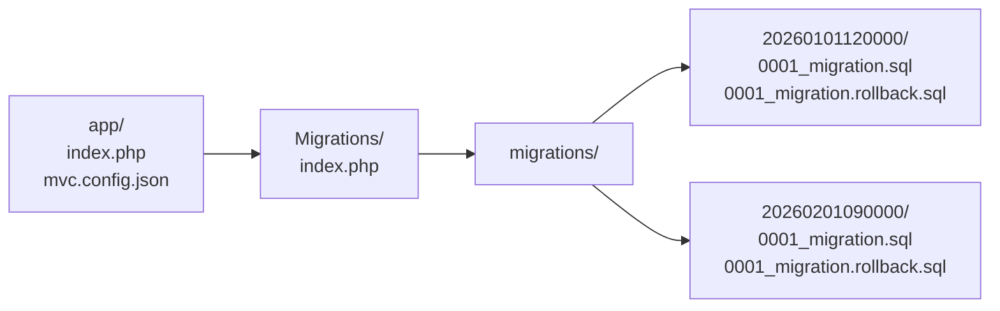
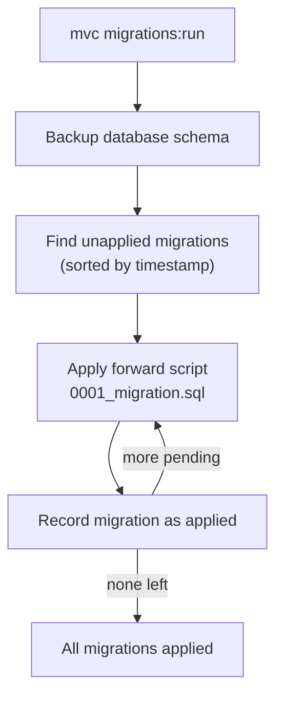

# Database Migrations

The migrations module provides SQL schema versioning with timestamped migration folders, forward and rollback scripts, database backups, and schema comparison for testing.

## Enable

From the app root (where `index.php` and `mvc.config.json` live):

```bash
vendor/bin/mvc migrations:enable [--path=<app-dir>] [--folder=<module-folder>]
```

| Option | Default | Description |
|--------|---------|-------------|
| `--path` | current directory | MVC app root containing `index.php` and `mvc.config.json`. |
| `--folder` | `Migrations` | Name of the migration module folder under the app root. |

This creates `<app>/<folder>/migrations/`, writes `<app>/<folder>/index.php`, and sets `migrationsFolderPath` and `migrationsEnabled: true` in `mvc.config.json`.

## Disable

```bash
vendor/bin/mvc migrations:disable [--path=<app-dir>] [--remove-files] [--force]
```

Sets `migrationsEnabled: false` and clears `migrationsFolderPath`. By default **no files are deleted**.

- `--remove-files` — delete the migration module directory from disk. Must be combined with `--force`.

## Folder layout



Each migration is a timestamped folder (`YYYYMMDDhhmmss`) containing:

- `0001_migration.sql` — forward script (applied with `mvc migrations:run`).
- `0001_migration.rollback.sql` — rollback script (applied to reverse the migration).

## Environment variables

The migration runner reads database settings from environment variables:

| Variable | Description |
|----------|-------------|
| `MIGRATIONS_DATABASE_HOST` | Database host. |
| `MIGRATIONS_DATABASE_NAME` | Database name. |
| `MIGRATIONS_DATABASE_USER` | Database user. |
| `MIGRATIONS_DATABASE_PASSWORD` | Database password. |

Set these before running migration commands.

## Create a migration

```bash
vendor/bin/mvc migrations:create --app-path=<app-dir>
```

Creates a new timestamped folder under `migrations/` with blank forward and rollback scripts. Edit them to add your DDL.

Override the migrations directory if needed (bypasses `mvc.config.json`):

```bash
vendor/bin/mvc migrations:create --path=<migrations-dir>
```

## Run pending migrations

```bash
vendor/bin/mvc migrations:run --app-path=<app-dir>
```

Applies all unapplied forward scripts in chronological order. The module records which migrations have been applied.

## Test a migration

Runs apply → rollback → schema comparison for a single migration folder:

```bash
vendor/bin/mvc migrations:test --app-path=<app-dir> --migration=<folder-name>
```

`<folder-name>` is the timestamped folder name (e.g. `20260101120000`). The test verifies that applying and rolling back the migration leaves the schema in its original state.

## Migration apply flow



## Best practices

- **Write rollback scripts** — every forward script should have a matching rollback. This enables `migrations:test` and safe production rollbacks.
- **One concern per migration** — create a new timestamped folder for each schema change. Avoid combining unrelated DDL in one migration.
- **Test before deploying** — run `migrations:test` on all new migrations in CI before applying to production.
- **Never edit applied migrations** — once a migration has been applied to any environment, treat it as immutable. Create a new migration to amend it.

## Related documentation

- [CLI Reference](../cli/reference.md) — all migration command flags.
- [Background Tasks](background-tasks.md) — background tasks depend on migrations for the default SQL table.
- [Authentication](../security/authentication.md) — `mvc auth:enable` generates auth migrations.
