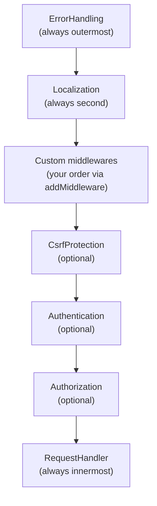

# Middleware

The framework uses a PSR-15 middleware pipeline. Middlewares run in a fixed outer order; custom middlewares are inserted inside that order, just before `RequestHandler`.

## Pipeline order



Request flows top-to-bottom; response propagates back up.

## Built-in middlewares

### `ErrorHandling`

Always the outermost middleware. Catches any uncaught `Throwable` from the inner chain and converts it to an HTTP error response using the mapping registered in `ErrorSettings`. Ensures the browser always receives a well-formed HTTP response.

### `Localization`

Detects the request locale (from `Accept-Language` header or a locale cookie) and stores it in `RequestContext`. The view engine reads this to resolve i18n keys.

### `CsrfProtection` _(opt-in)_

Enable with:

```php
$app->useCsrfProtection();
```

- **Safe methods** (`GET`, `HEAD`, `OPTIONS`): generates a CSRF token and stores it in `RequestContext`. Does not block.
- **Unsafe methods** (`POST`, `PUT`, `PATCH`, `DELETE`): validates the token from body field `_csrf` or header `X-CSRF-Token`. Returns `403` on failure.

### `Authentication` _(opt-in)_

Enable with:

```php
$app->useAuthentication();
```

Reads the auth cookie, calls `IdentityManager::getIdentity()`, and stores the result in `RequestContext`. Does **not** block unauthenticated requests by itself.

### `Authorization` _(opt-in)_

Enable with:

```php
$app->useAuthorization();
```

Reads the current route's `authRequired` and `roles` from the matched `Route`. Redirects unauthenticated users to `AuthSettings::signInPath` (clearing the auth cookie). Returns `403` for authenticated users who lack the required role.

## Adding custom middlewares

Implement PSR-15 `MiddlewareInterface`:

```php
use Psr\Http\Message\ResponseInterface;
use Psr\Http\Message\ServerRequestInterface;
use Psr\Http\Server\MiddlewareInterface;
use Psr\Http\Server\RequestHandlerInterface;

final class RateLimitMiddleware implements MiddlewareInterface
{
    public function process(
        ServerRequestInterface $request,
        RequestHandlerInterface $handler,
    ): ResponseInterface {
        // inspect request...

        return $handler->handle($request); // pass through
    }
}
```

Register in your app entrypoint **before** calling `run()`:

```php
$app->addMiddleware(RateLimitMiddleware::class);
```

The middleware is resolved from the container, so constructor injection works. Multiple `addMiddleware()` calls run in registration order.

