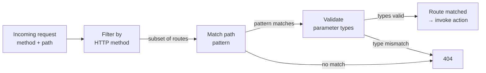

# Routing

The routing API maps URL patterns and HTTP methods to controller actions. Routes are registered in the `router()` method of your `MvcWebApp` subclass.

## Core classes

| Class | Role |
|-------|------|
| `PhpMvc\Routes\Router` | Collection of routes; matches an incoming request to a `Route`. |
| `PhpMvc\Routes\Route` | A single route: method + path + controller + action + security metadata. |
| `PhpMvc\Routes\RouteMethod` | Enum of HTTP methods: `Get`, `Post`, `Put`, `Patch`, `Delete`, `Head`, `Options`. |
| `PhpMvc\Routes\Path` | Compiled path pattern with typed parameter extraction. |

## Registering routes

```php
use PhpMvc\Routes\Router;
use PhpMvc\Routes\Route;
use PhpMvc\Routes\RouteMethod;
use PhpMvc\Routes\Path;

$router = new Router();

$router->register(Route::create(
    RouteMethod::Get,
    Path::create('/'),
    HomeController::class,
    'index',
));

$router->register(Route::create(
    RouteMethod::Get,
    Path::create('/articles/{int:id}'),
    ArticleController::class,
    'show',
));

$router->register(Route::create(
    RouteMethod::Post,
    Path::create('/articles/{int:id}/comments'),
    CommentController::class,
    'store',
    authRequired: true,
    roles: ['user', 'admin'],
));
```

## Typed path parameters

`Path` supports four typed segment placeholders. The type is validated at match time, so an invalid value (e.g. a string where `{int:id}` is expected) results in a 404.

| Syntax | PHP type | Validation |
|--------|----------|------------|
| `{name}` | `string` | Any non-empty segment |
| `{int:name}` | `int` | Digits only (casted to `int`) |
| `{float:name}` | `float` | Numeric (casted to `float`) |
| `{uuid:name}` | `string` | UUID v4 format |

Example paths:

```
/users/{int:id}          → int $id
/files/{uuid:token}      → string $token (validated UUID)
/products/{slug}         → string $slug
/prices/{float:amount}   → float $amount
```

## Security metadata

```php
Route::create(
    RouteMethod::Post,
    Path::create('/admin/users/{int:id}/delete'),
    AdminController::class,
    'delete',
    authRequired: true,
    roles: ['admin'],
);
```

- **`authRequired: true`** — the `Authorization` middleware redirects unauthenticated requests to `AuthSettings::signInPath`.
- **`roles`** — an array of allowed role names. An authenticated user must have at least one matching role from `Identity::getRoles()`. An empty `roles` array allows any authenticated user.

## Route matching flow


